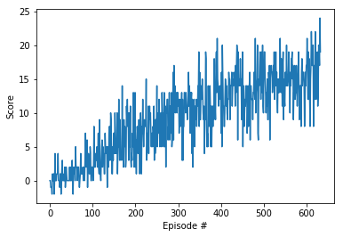
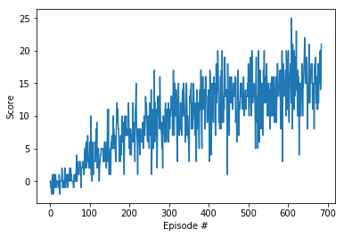

[//]: # (Image References)

[image1]: https://user-images.githubusercontent.com/10624937/42135619-d90f2f28-7d12-11e8-8823-82b970a54d7e.gif "Trained Agent"

# Project 1: Navigation

### Description
  - dqp_agent.py: code for agent in the environment
  - model.py: code for fully-connected network model
  - dqn.pth: saved model weights for the original DQN model
  - double_dqn.pth: saved model weights for the Double DQN model
  - Navigation.ipynb: notebook containing the solution
  - Report.md: project report

### Introduction

For this project, I am training an agent to navigate (and collect bananas) in a large, square world.
Following is the detail rule for the game,

A reward of +1 is provided for collecting a yellow banana, and a reward of -1 is provided for collecting a blue banana.  Thus, the goal of your agent is to collect as many yellow bananas as possible while avoiding blue bananas.  

The state space has 37 dimensions and contains the agent's velocity, along with ray-based perception of objects around agent's forward direction.  Given this information, the agent has to learn how to best select actions.  Four discrete actions are available, corresponding to:
- **`0`** - move forward.
- **`1`** - move backward.
- **`2`** - turn left.
- **`3`** - turn right.

The task is episodic, and in order to solve the environment, your agent must get an average score of +13 over 100 consecutive episodes.

### Algorithms

The core of the algorithm follows the Deep Q-learning from the previous learning section and this paper,
[Deep Q-learning, DeepMind](https://storage.googleapis.com/deepmind-media/dqn/DQNNaturePaper.pdf).

We use a neural network as function to approximate the Q-value table here.
More specifically, we choose a 2-hidden layer network with both the layers having 64 hidden units with relu activation applied after each fully-connected layer.
Adam was used as the optimizer for finding the optimal weight.

In order to make the network more stable, we use two tricks, the fixed Q and replay buffer, here.
* [fixed Q],
During training process, the weights of the target network to calculate the rewards are freezing the model parameters for a few iterations.

* [replay buffer],
If we keep learning from experiences as they come, then we are basically observed a sequence of observations each of which are linked to each other. This destroys the assumption of the samples being independent. In ER, we maintain a Replay Buffer of fixed size (say N). We run a few episodes and store each of the experiences in the buffer. After a fixed number of iterations, we sample a few experiences from this replay buffer and use that to calculate the loss and eventually update the parameters. Sampling randomly this way breaks the sequential nature of experiences and stabilizes learning. It also helps us use an experience more than once.

Also I implemented double deep Q network for comparison.
The idea of Double DQN is to disentangle the calculation of the Q-targets into finding the best action and then calculating the Q-value for that action in the given state.
The trick then is to use one network to choose the best action and the other to evaluate that action.

### Hyperparameters

There were many hyperparameters involved in the experiment. The value of each of them is given below,

|   parameter         | Double-DQN  |
|---|---|
| Replay buffer size 	| 1e5         |
|Batch size 	        | 64          |
|$\gamma$ (discount factor) |	0.99  |
|$\tau$ 	            | 1e-3        |
|Learning rate 	      | 5e-4        |
|update interval 	    | 4           |
|Number of episodes 	| 500         |
|Max number of timesteps per episode | 	2000 |
|Epsilon start 	      | 1.0         |
|Epsilon minimum 	    | 0.1         |
|Epsilon decay        |	0.995       |

### Results

The convergence rates are as following, in order to tune the model for better performance, the convergence condition is the last 100 trails' mean score is higher than 15. Based on the following table, at current same parameters, the two algorithms' performances are similar.

|   DQN                      | Double-DQN  |
|---|---|
|     |  |
| converge in 537 iterations |  convergen in 585 iterations     |
| score 22 for testing case  | score 12 for testing case        |

### Further thoughts
Here are some further trials that may raise the improvement.
1, [prioritized replay](https://arxiv.org/abs/1511.05952)
2, dueling network from the previous lecture
