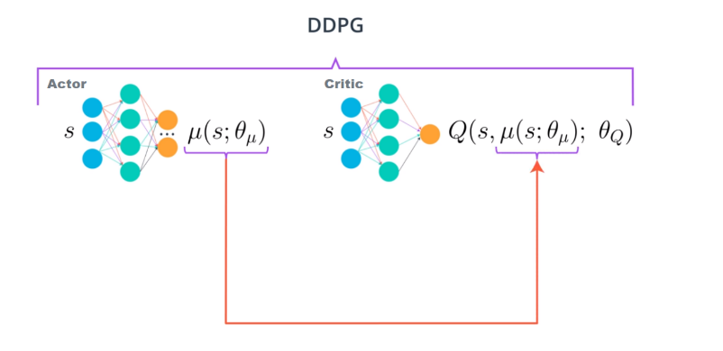
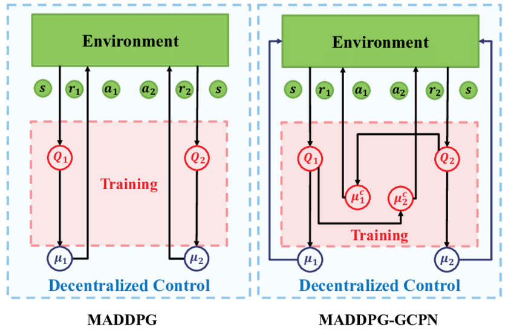
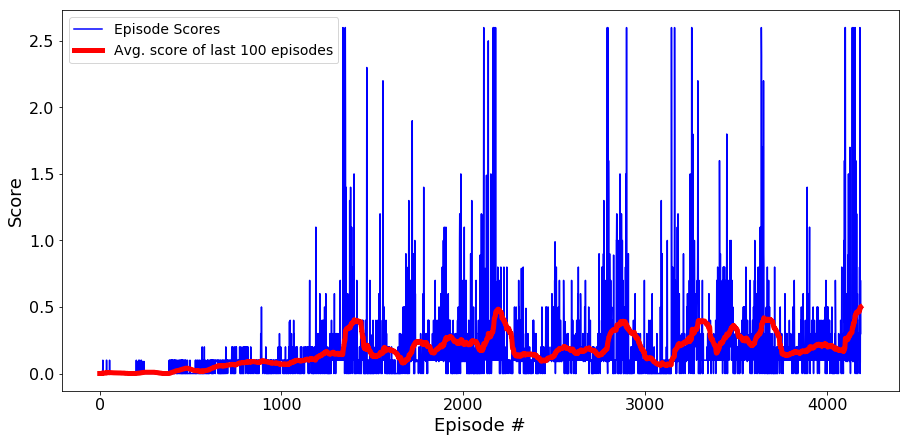

# Project 3: Collaboration and Competition

In this environment, two agents control rackets to bounce a ball over a net. If an agent hits the ball over the net, it receives a reward of +0.1.  If an agent lets a ball hit the ground or hits the ball out of bounds, it receives a reward of -0.01.  Thus, the goal of each agent is to keep the ball in play.

The observation space consists of 8 variables corresponding to the position and velocity of the ball and racket. Each agent receives its own, local observation.  Two continuous actions are available, corresponding to movement toward (or away from) the net, and jumping.

The task is episodic, and in order to solve the environment, your agents must get an average score of +0.5 (over 100 consecutive episodes, after taking the maximum over both agents).

The observation space consists of 33 variables corresponding to position, rotation, velocity, and angular velocities of the arm. Each action is a vector with four numbers, corresponding to torque applicable to two joints. Every entry in the action vector is a number between -1 and 1. An agent choosing actions randomly can be seen in motion below:

Here is the list of project codes and results,
- **./Tennis.ipynb**: the python notebook to train the agent with MADDPG
- **./model.py**: the PyTorch model for actor and critic
- **./checkpoint_actor_agent_0.pth**: actor network's final weight for player 0
- **./checkpoint_actor_agent_1.pth**: actor network's final weight for player 1
- **./checkpoint_critic_agent_0.pth**: critic network's final weight for player 0
- **./checkpoint_critic_agent_1.pth**: critic network's final weight for player 1

The following report is written in four parts:
- **Implementation**
- **Results**
- **Ideas for improvement**

## Implementation

In this model every agent itself is modeled as a Deep Deterministic Policy Gradient (DDPG) agent where, however, some information is shared between the agents, as MADDPG.
In particular, each of the agents in this model has its own actor and critic model. The actors each receive as input the individual state (observations) of the agent and output a (two-dimensional) action.
The critic model of each actor, however, receives the states and actions of all actors concatenated.
This should facilitate the information sharing between the agents.

The DDPG model is the same with Project 2, 2 fully connected hidden layers with ReLu activations for both the actors and critics.
The sizes of two hidden layers are 256/256.

### Hyperparameters

There were many hyperparameters involved in the experiment. The value of each of them is given below:

| Hyperparameter                      | Value |
| ----------------------------------- | ----- |
| Replay buffer size                  | 1e4   |
| Batch size                          | 256   |
| $\gamma$ (discount factor)          | 0.99  |
| $\tau$                              | 1e-3  |
| Actor Learning rate                 | 1e-4  |
| Critic Learning rate                | 1e-3  |
| Max number of episodes              | 10000 |
| Max number of timesteps per episode | 1000  |

### Results

As outlined above the environment could be solved in ∼ 4200 episodes, significantly more than what I expected.
Moreover, the training takes several tries, the first time the performance had not been convergent.
Below, we have the results of a training run with the final setup (individual episode scores are shown).
Progress is very slow to begin with, the agent stalls at an average score of  0.1 for more than 1000 episodes at first.
Also the training takes a lot of backs and loses, it has several score peaks around Episode 1500, 2200, 2800, 3200, 3400, 3600 and finally reaches 0.5 around 4200 episodes.

The plot of the rewards across episodes is shown below:

## Ideas for improvement
One of the most obvious directions for additional research would be the change of the model.
In particular, one could try Proximal Policy Optimization (PPO) or MADDPG-GCPN on this task.
